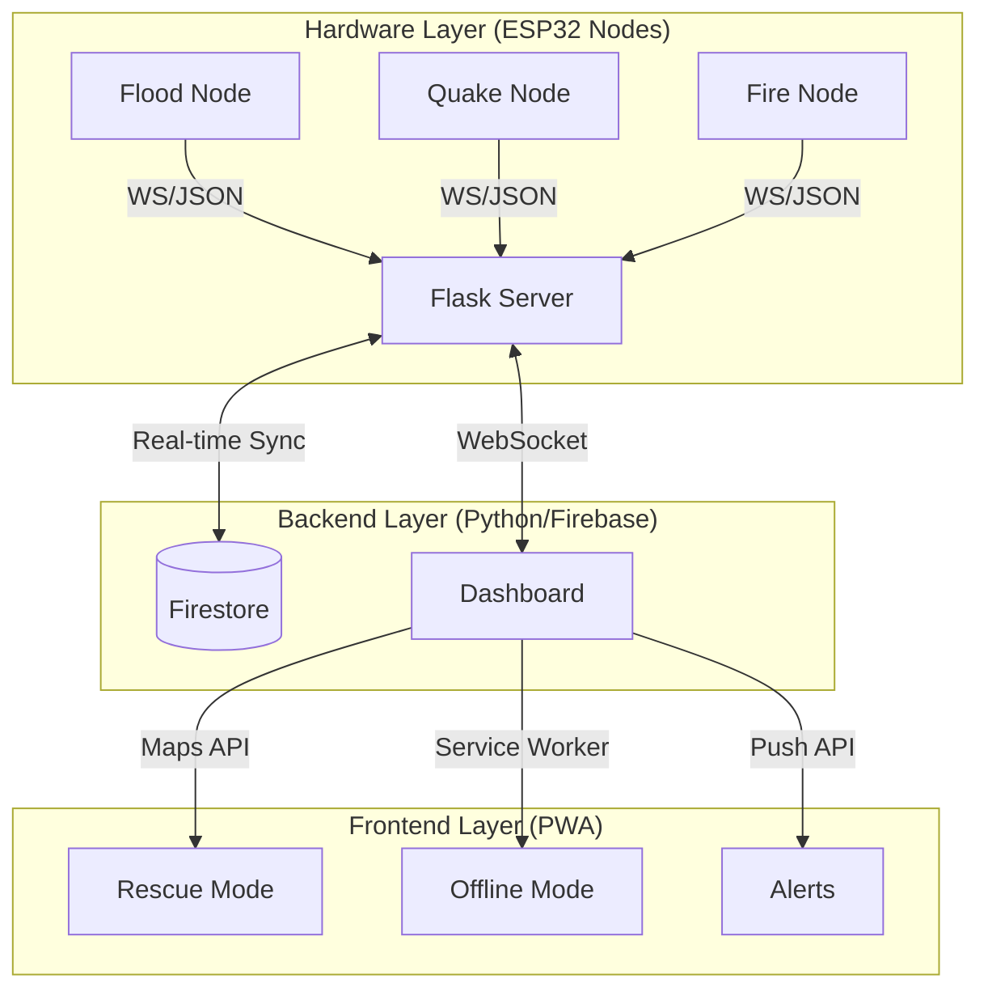

# 🛡️ LifeGuard: Multi-Disaster Management System

**LifeGuard** is a next-generation, IoT-powered disaster management platform designed to provide real-time monitoring, early warning alerts, and intelligent rescue coordination for multiple disaster scenarios: **Floods, Earthquakes, and Wildfires.**

Integrating custom-built hardware nodes with a high-performance web dashboard, LifeGuard ensures that first responders and citizens have life-saving information at their fingertips—even in low-connectivity environments.

---

## 🚀 Key Features

- **Modular Sensor Ecosystem**: Dedicated ESP32 nodes for specialized disaster detection.
- **Real-Time Visualization**: A premium, interactive dashboard with live data streaming via WebSockets.
- **AI-Driven Alerts**: Intelligent status predictions based on multi-sensor data fusion.
- **Advanced Rescue Intelligence**: Google Maps integration (Advanced Markers) with live GPS tracking and route recalculation.
- **PWA Excellence**: Fully responsive, offline-ready application with push notifications and service worker caching.
- **Local Alerting**: Hardware-level buzzers and LEDs for immediate on-site warnings.

---

## 🌟 Advanced Platform Enhancements (v3.0 Sovereign Release)

- **Dynamic IoT Micro-Climate Telemetry Binding**:
  - Homepage Atmospheric Data card binds directly to the physical DHT11 sensor on the Wildfire ESP32 Edge Node in real time.
  - Features a dual-channel fallback system that pulls OpenWeather API forecast data on startup, transitioning instantly to live telemetry with a glowing `📡 Source: Live DHT11 Sensor` label the split-second the edge device boots.
- **Symmetrical Bento Grid Redesign**:
  - Re-engineered the desktop dashboard grid to fit a mathematically aligned 3-row layout, solving card stretching and layout voids.
  - Stacks the compact Weather Card (Row 1) and Guard Modules (Row 2) flush alongside the dual-row Integrated AI Risk Gauge.
- **Widescreen Command Ticker & Deduplication**:
  - Restructured the narrow vertical broadcasts panel into a full-width horizontally readable command ticker (`grid-column: 1 / -1`) at the bottom of the grid, ensuring critical readouts are never column-squished.
  - Implemented client-side `seenMessages` hashing cache within the Firestore listener to guarantee zero duplicate alert messages in the UI.
- **Autonomous End-to-End Threat Escalation Pipeline**:
  - The Python backend AI analyzer (`ai_listener.py`) automatically evaluates incoming telemetry and publishes live broadcast logs the instant any node crosses danger thresholds ($\ge 70\%$) or active triggers (flame/shock triggers), instantly rendering alerts globally in sub-second latency.

## 🌟 Advanced Platform Enhancements (v2.0)

- **Interactive Multi-Node Ambient Dashboards**:
  - **Wildfire Ember Particles**: Canvas particles morph into glowing orange-red ash and float upward as wildfire risks escalate.
  - **QuakeShield Full-Screen Shaking**: Real-time high-frequency tremor keyframes shake the entire dashboard body when seismic warning values are reached.
- **Multi-Sensor Cross-Node Telemetry Sync**:
  - Automated cross-node sync pulls live ambient temperature and humidity from the active Fire Node (DHT11) directly onto the Flood dashboard, filling sensor gaps seamlessly.
- **Live Heartbeat Node Status Evaluator**:
  - Dynamic connection monitor tracks Firestore telemetry timestamps against the clock, instantly toggling modules between glowing **Online** and **Standby** modes as hardware connects/disconnects.
- **Hardware-Level Resiliency**:
  - Replaced all blocking delay statements inside ESP32 loops with non-blocking timer loops to safeguard on-site alarms and telemetry continuity.

---

## 🏗️ System Architecture



---

## 🔌 Hardware Specifications

The project utilizes a 3-node modular architecture, each optimized for specific environmental threats.

### 1. Flood & Rainfall Node (`node_flood_01`)
*   **MCU**: ESP32
*   **Sensors**:
    *   **HC-SR04**: Ultrasonic sensor for high-precision water level monitoring.
    *   **Rain Sensor**: Analog sensing for real-time precipitation intensity.
*   **Alerts**: 1000Hz Buzzer + Red Alert LED.

### 2. Earthquake & Vibration Node (`node_quake_01`)
*   **MCU**: ESP32
*   **Sensors**:
    *   **MPU6050**: 3-axis accelerometer for seismic activity detection (Raw I2C).
    *   **SW420**: High-sensitivity vibration/shock sensor.
*   **Alerts**: 2000Hz Pulsed Buzzer + Structural Integrity LED.

### 3. Wildfire & Air Quality Node (`node_fire_01`)
*   **MCU**: ESP32
*   **Sensors**:
    *   **MQ-135**: Gas/Smoke/CO2 sensor for air quality and smoke detection.
    *   **DHT11**: Temperature and Humidity monitoring for wildfire risk assessment.
    *   **Flame Sensor**: Infrared detection for active fire proximity.
*   **Alerts**: 1500Hz Continuous Buzzer + Fire Warning LED.

---

## 💻 Software Tech Stack

### Frontend
- **Core**: Vanilla HTML5, JavaScript (ES6+), CSS3 (Custom Design System).
- **Mapping**: Google Maps JavaScript API (Advanced Markers, Directions API).
- **State Management**: Firebase Firestore (Real-time).
- **PWA**: Workbox-powered Service Workers, Manifest v3.
- **Aesthetics**: Canvas-based particle systems, Glassmorphism, and smooth CSS transitions.

### Backend
- **Framework**: Python Flask.
- **Communication**: Flask-Sockets for bi-directional real-time data flow.
- **Database**: Firebase Admin SDK (Firestore).
- **Deployment**: Configured for Render.

---

## 🛠️ Local Development

### 1. Prerequisites
- Python 3.9+
- Node.js (for frontend scripts)
- Arduino IDE (for hardware deployment)
- Firebase Project with Firestore enabled.

### 2. Backend Setup
```bash
cd backend
python -m venv .venv
source .venv/bin/activate  # Windows: .\.venv\Scripts\Activate
pip install -r requirements.txt
# Add serviceAccountKey.json to the /backend folder
python main.py
```

### 3. Frontend Setup
```bash
cd frontend
# Install dependencies for configuration scripts
npm install
# Generate environment-specific config
node ../scripts/gen-config.js
```

---

## 🌐 Deployment

### Backend (Render)
1. Deploy using the provided `render.yaml` blueprint.
2. Set `SERVICE_ACCOUNT_JSON` and `GOOGLE_MAPS_API_KEY` as environment variables.

### Frontend (Vercel)
1. Import the `frontend` directory.
2. Set the build command to `node ../scripts/gen-config.js && exit 0`.
3. Configure `WS_URL` and `GOOGLE_MAPS_API_KEY` in Vercel settings.

---

## 🛡️ Security & Best Practices
- **Secret Management**: All API keys and Firebase credentials are managed via environment variables.
- **Low Latency**: WebSockets are used for critical sensor alerts to minimize response time.
- **Resilience**: Service workers ensure the dashboard remains accessible during network failures.

---

## 📜 License
This project is licensed under the MIT License - see the [LICENSE](LICENSE) file for details.

---
*Created with ❤️ by the LifeGuard Team.*
